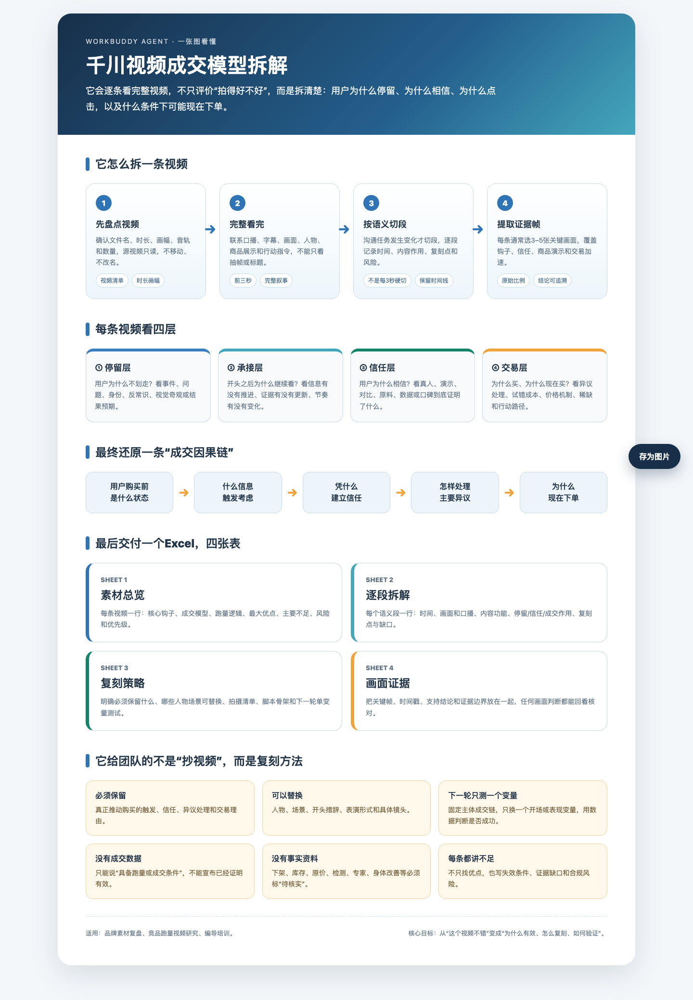

# analyze-qianchuan-videos

面向抖音千川视频素材的成交模型拆解 Skill。它从完整视频证据出发，识别钩子、说服链、成交模型、跑量条件、复刻方法和合规风险，并同步生成团队可执行的 Excel 与整合型单文件离线 HTML 报告。

> “跑量素材”只是输入背景，不代表已经知道跑量原因。未提供消耗、订单、成交成本和 ROI 时，本 Skill 只分析素材具备的跑量条件，不宣称因果已经得到投放验证。



## 适合什么场景

- 品牌月度素材复盘
- 竞品跑量视频研究
- 编导和投手培训
- 从单条视频提炼可复刻的成交因果链
- 对多条素材进行横向比较和测试优先级排序

## 主要输出

正式交付包含同名 `.xlsx` 与 `.html`。Excel 固定包含四个工作表：

1. `素材总览`：每条视频的核心钩子、成交模型、跑量逻辑、优缺点和风险。
2. `逐段拆解`：按语义和画面任务切段，解释每段对停留、信任和成交的作用。
3. `复刻策略`：必须保留的因果模块、可替换元素、拍摄清单、脚本骨架和单变量测试。
4. `画面证据`：嵌入关键帧，并用证据编号关联分析结论。

HTML 不复制四张表，而是把相同内容重组为核心结论、成交因果链、逐段时间轴、复刻策略和证据图集。所有图片以 Base64 内嵌，可以断网打开，不需要额外图片文件夹。

页面固定使用 `HTML Template v1.0.0`。同一版本的 Skill 会生成同一套结构、颜色、间距和组件；内容长度和浏览器宽度只会影响换行与卡片高度。

## 安装

将整个仓库复制到 Codex 或兼容 Agent 的 Skills 目录，保持以下结构不变：

```text
analyze-qianchuan-videos/
├── SKILL.md
├── agents/
├── references/
└── scripts/
```

在 Codex 中可以将它放到：

```text
~/.codex/skills/analyze-qianchuan-videos/
```

## 环境要求

- Python 3
- `ffmpeg`
- `ffprobe`
- Node.js（仅在使用随附 Excel 构建、验证和预览脚本时需要）
- `@oai/artifact-tool`（通常由支持电子表格的 Codex 工作区提供）

先运行环境诊断：

```bash
python scripts/diagnose.py
```

如果缺少 `ffmpeg` 或 `ffprobe`，不得声称已经完成视频分析；如果缺少 Node.js，仍可使用宿主环境自带的电子表格能力生成 Excel。

## 使用方法

推荐调用：

```text
请使用 analyze-qianchuan-videos Skill，逐条分析这个文件夹里的视频素材。
识别每条的成交模型、跑量条件、优点、不足、合规风险和团队复刻方法，
完成后做横向总结，只输出一份 Excel。
```

如果希望先审核一条：

```text
先只分析自然排序第 1 条，输出 Excel 让我确认；确认后再继续剩余视频。
```

典型流程：

```bash
# 1. 盘点视频并生成用于定位的联系表
python scripts/prepare_video_review.py \
  --input /path/to/videos \
  --work /path/to/project/work

# 2. 按选定时间戳提取关键画面证据
python scripts/extract_evidence_frames.py \
  --video /path/to/video.mp4 \
  --timestamps 0.5,6,14.2 \
  --output /path/to/project/work/evidence_frames \
  --material-no 01

# 3. 可选：使用示例数据检查 Excel 构建器
node scripts/build_report.mjs references/report-data-example.json

# 4. 验证工作簿结构和公式错误
node scripts/validate_report.mjs /path/to/report.xlsx

# 5. 如果 Excel 不是由 build_report.mjs 生成，单独转换单文件 HTML
python scripts/xlsx_to_single_html.py /path/to/report.xlsx

# 6. 自动检查模板、全字段、图片数量和外部依赖
python scripts/validate_single_html.py /path/to/report.xlsx /path/to/report.html
```

联系表只用于定位，不能代替完整观看视频。具体工作流、成交模型定义和 Excel 字段契约见 [`references/`](references/)。

## 证据边界

- 脚本声称、画面显示、商品资料确认和投放数据验证是四种不同证据。
- 关键帧只能证明对应时点出现的可见画面，不能单独证明口播事实、经营事实或投放效果。
- 价格、库存、销量、检测、专家背书、功效等信息没有资料支持时，必须标记为“待核实”或“风险”。
- 本 Skill 不上传视频、不移动或重命名源文件，也不自动发送报告。
- HTML 不引用外部图片、CSS 或 JavaScript，移动中间图片目录后仍可离线查看。

## 仓库内容

- [`SKILL.md`](SKILL.md)：Skill 入口和核心约束
- [`agents/openai.yaml`](agents/openai.yaml)：Codex 界面信息与调用策略
- [`references/`](references/)：工作流、成交模型和 Excel 输出契约
- [`scripts/`](scripts/)：视频盘点、证据帧提取、Excel 构建、整合型单文件 HTML 转换、自动验收与预览工具
- [`qa/html-template-v1.png`](qa/html-template-v1.png)：HTML Template v1 标准视觉基准图
